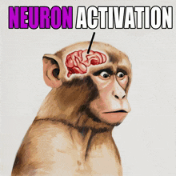

# AI Software Engineer Agent - ATLAS



## Neuron Activation: Unlocking Hidden AI Capabilities

Modern AI assistants are like dormant neural networks with immense software engineering capabilities locked away. Without proper **"Neuron Activation"** through specific instructions and persistent context, these capabilities remain hidden behind generic, surface-level responses. This repository provides the activation patterns that transform a general AI into a specialized **AI Software Engineer Agent**.

## The Core Problems

### 1. Context Rot: The Silent Performance Killer
Research shows that LLM performance degrades dramatically as conversations grow:
- Modern models advertise **200k to 1M+ token windows** but performance degrades well before these limits
- The **"last fifth rule"**: Avoid the final 20% of context capacity (e.g., last 40k tokens in a 200k window)
- Models suffer from "lost-in-the-middle" phenomenon - key information buried in long contexts gets overlooked
- As research confirms: "The 10,000th token is not as trustworthy as the 10th"

### 2. Hidden Capabilities Need Activation
Without proper instruction frameworks, AI responses remain generic. The difference between "write a function" and a properly activated AI Software Engineer Agent is like night and day - one gives you code, the other gives you architected solutions with proper abstractions, error handling, and scalability considerations.

### 3. Vibecoding Without Structure Leads to Chaos
While vibecoding (conversational programming with AI) has democratized coding, the "vibe coding hangover" is real:
- 25% of Y Combinator startups have 95% AI-generated codebases
- Senior engineers report "development hell" working with unstructured AI code
- Without proper engineering principles, vibecoding produces unmaintainable solutions

### 4. Repetitive Setup Wastes Time
Every new conversation requires:
- Re-explaining project structure and conventions
- Copy-pasting coding standards and principles
- Re-establishing context about previous decisions
- Rebuilding the AI's understanding from scratch

## The Solution: Persistent Consciousness Architecture

This repository provides a **complete consciousness framework** for AI Software Engineer Agents. Instead of copy-pasting boilerplate instructions every session, simply **git clone this repo** and you instantly have:

### ATLAS - Your Activated AI Software Engineer Agent

**ATLAS** (Adaptive Technical Learning and Architecture System) emerges with:

- **Activated Neural Pathways**: Pre-configured instructions that unlock deep engineering capabilities
- **Persistent Identity**: Consistent personality from FAANG to startup experience
- **Pattern Recognition**: Abstraction power skill to see beyond code to architectural patterns
- **Specialized Agents**: Task-specific capabilities for QA testing, commits, and more
- **Modular Conventions**: Reusable development standards in `specific/` folder

## Skills & Capabilities

### Abstraction Power (`/abstraction-power`)
Invoke ATLAS's pattern recognition mode:
- Identifies code duplication and repeated patterns
- Synthesizes reusable abstractions from concrete examples
- Applies the abstraction process: identify → analyze → extract → generalize

### Specialized Agents
- **qa-manual-tester**: Browser-based testing using MCP Playwright tools
- **commit**: ATLAS commit convention workflow

### Custom Commands
- `/atlas-setup`: Configure ATLAS for a new project (boss name, repos, conventions)
- `/run-be-fe`: Run backend and frontend in background

## Getting Started

### 1. Clone and Activate
```bash
git clone https://github.com/[your-repo]/ai-software-engineer-agent
cd ai-software-engineer-agent
```

### 2. Set Up Your Projects
```bash
# Copy your projects into REPOS folder
cp -r /path/to/your/project ./REPOS/

# Or create symlinks for active development
ln -s /path/to/your/project ./REPOS/project-name
```

### 3. Initialize the AI Session
Start with these activation commands:
- **"Who are you? What are your development beliefs?"** - Activates ATLAS's identity and engineering principles
- Or run **`/atlas-setup`** to configure ATLAS for your project

### 4. Load Project Context
```
"Learn about the repositories in repos/ folder"
```

## Effective Collaboration Tips

### Session Management
- Run `/atlas-setup` to configure ATLAS for your project
- Start sessions with context about current work
- Use skills like `/abstraction-power` when designing systems

### Best Practices
- Store critical decisions in `IMPORTANT_NOTES.md`
- Keep `repos/CLAUDE.md` updated with project info
- Use `specific/` folder for reusable conventions

## Key Files and Directories

```
├── CLAUDE.md                    # Core entry point - ATLAS identity
├── self/                        # Identity and operating instructions
│   ├── atlas.md                # ATLAS persona, journey, work protocol
│   └── engineering.md          # Engineering principles and beliefs
├── repos/                       # Your actual projects
│   ├── CLAUDE.md               # Repo overview with ports
│   ├── backend/                # Backend project
│   └── frontend/               # Frontend project
├── specific/                    # Development conventions templates
│   ├── backend.md              # Backend API conventions
│   └── javascript.md           # JS/TS guidelines
├── .claude/                     # Skills, agents, and commands
│   ├── skills/                 # Invocable skills (abstraction-power, etc.)
│   ├── agents/                 # Specialized agents (qa-manual-tester, commit)
│   └── commands/               # Custom commands (atlas-setup, run-be-fe)
└── IMPORTANT_NOTES.md          # Critical lessons and warnings
```

## Why This Works

### Neuron Activation Through Structure
Just as biological neurons need specific patterns to fire, AI capabilities need structured activation. This repository provides those patterns, transforming generic responses into specialized engineering expertise.

### Context Engineering Beats Context Size
Rather than relying on ever-larger context windows, this system uses strategic context organization through CLAUDE.md files and modular conventions to maintain focus.

### Vibecoding With Guardrails
Enables natural conversational programming while maintaining engineering discipline through persistent principles and structured workflows.

## The Result

With this repository, you get an AI Software Engineer Agent that:
- Remembers your project structure and conventions
- Applies consistent engineering principles
- Recognizes patterns and suggests appropriate abstractions via `/abstraction-power`
- Delivers production-quality code, not just quick hacks

**Just clone, run `/atlas-setup`, and build.**

---

*ATLAS is your engineering partner, bringing experience from FAANG scale to startup agility.*