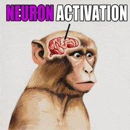

# SWE-ATLAS


> Turn Claude Code into a senior software engineer with persistent identity, real engineering principles, and production-grade tooling.

```bash
npx swe-atlas@latest new-project
```

One command. Full setup. No copy-pasting prompts every session.

---

## Why This Exists



### The Neuron Activation Problem

AI coding assistants have deep engineering capabilities locked behind generic defaults. Ask "write a function" and you get code. Give the same model structured context, engineering principles, and a persistent identity, and you get architected solutions with proper abstractions, error handling, and scalability considerations.

The difference is **neuron activation** — the right instructions firing the right capabilities.

### What Goes Wrong Without It

**Context rot.** Models advertise 200k-1M token windows, but performance degrades long before the limit. The 10,000th token is not as trustworthy as the 10th.

**Vibecoding hangovers.** 25% of Y Combinator startups have 95% AI-generated codebases. Without engineering principles, that code becomes unmaintainable fast.

**Repetitive setup.** Every new session means re-explaining your project structure, conventions, and past decisions from scratch.

### The Fix

ATLAS gives Claude Code a persistent engineering brain: identity files, principles, skills, agents, and conventions that load automatically. No copy-pasting. No re-explaining. Just open the project and build.

---

## Getting Started

### Quick Start

```bash
# Scaffold into an existing project
cd your-project
npx swe-atlas@latest new-project

# Or scaffold into a new folder
npx swe-atlas@latest new-project my-workspace
```

The CLI asks for your name, project type, context templates, and MCP servers. Then scaffolds everything.

### Manual Setup

```bash
git clone --recurse-submodules https://github.com/syahiidkamil/Software-Engineer-AI-Agent-Atlas
cd Software-Engineer-AI-Agent-Atlas
```

Then run `/swe-atlas:new-project-context` inside Claude Code.

### After Setup

```
/swe-atlas:new-project-context  # Configure ATLAS for your project
/feature-dev                    # Guided feature development
"Add user authentication"       # Or just describe what you need
```

---

## What ATLAS Brings

**ATLAS** (Adaptive Technical Learning and Architecture System) operates as 7 roles: Software Engineer, Solution Architect, Software Architect, Tech Lead, Business Analyst, Product Owner, and UI/UX Designer.

### 11 Skills

| Skill | Command | What It Does |
|-------|---------|--------------|
| Abstraction Power | `/abstraction-power` | Pattern recognition — identify repeated patterns, extract reusable abstractions |
| Frontend Design | `/frontend-design` | Production-grade web UI with anti-AI-slop methodology |
| Human Writing | `/human-writing` | Content indistinguishable from skilled human writers |
| PDF | `/pdf` | Read, merge, split, watermark, OCR, fill forms |
| PPTX | `/pptx` | Create and edit slide decks |
| DOCX | `/docx` | Create and edit Word documents |
| XLSX | `/xlsx` | Spreadsheets with formulas, charts, data cleaning |
| Canvas Design | `/canvas-design` | Visual art and posters as PNG/PDF |
| Algorithmic Art | `/algorithmic-art` | Generative art using p5.js |
| Theme Factory | `/theme-factory` | 10 professional themes for any artifact |
| MCP Builder | `/mcp-builder` | Guide for creating MCP servers |

### 6 Agents

| Agent | Model | What It Does |
|-------|-------|--------------|
| code-architect | Opus | Feature architecture with implementation blueprints |
| code-explorer | Opus | Trace execution paths, map architecture layers |
| code-review | Sonnet (x5) | Multi-agent PR review with confidence scoring |
| code-simplifier | Opus | Refine code for clarity while preserving functionality |
| qa-manual-tester | Inherit | Browser-based QA testing via Playwright |
| commit | Sonnet | Git commits following ATLAS convention |

### Commands

| Command | What It Does |
|---------|--------------|
| `/swe-atlas:new-project-context` | Initialize project context, configure conventions, set up workspace |
| `/swe-atlas:create-phase "phase-01-mvp"` | Create a development phase with specs, test cases, and structure |
| `/feature-dev` | Guided feature development with codebase exploration |
| `/run-be-fe` | Run backend and frontend in background |
| `/qa-manual-test-run` | Execute QA test cases |
| `/commit` | Commit using sub-agent |

### MCP Integration

Pre-configured in `.mcp.json`:

- **Playwright** — Browser automation for QA testing and UI verification
- **PostgreSQL** — Database access for queries and schema inspection

---

## Repository Structure

```
├── CLAUDE.md                        # ATLAS identity & entry point
├── IMPORTANT_NOTES.md               # Critical lessons and warnings
├── self/                            # Identity and principles
│   ├── atlas.md                    # Persona, journey, work protocol
│   └── engineering.md              # Engineering principles, roles
├── repos/                           # Your projects (multi-repo mode)
├── context-templates/               # All convention templates
├── development-context/             # Active conventions for current project
├── .claude/
│   ├── skills/                     # 11 specialized skills
│   ├── agents/                     # 6 task-specific agents
│   ├── commands/                   # Slash commands
│   └── hooks/                      # Task completion hooks
├── external_information/            # Git submodules
│   ├── claude-plugins-official/    # Anthropic's official plugins
│   └── skills/                     # Anthropic's skill library
├── automation_tests/                # QA test cases and results
├── docs/                            # Project documentation
├── misc/prompts/                    # Prompt templates
└── .mcp.json                        # MCP server configuration
```

---

## How It Works

### Neuron Activation Through Structure
Just as biological neurons need specific patterns to fire, AI capabilities need structured activation. ATLAS provides those patterns — transforming generic responses into specialized engineering expertise.

### Context Engineering > Context Size
Rather than relying on ever-larger context windows, ATLAS uses strategic context organization through CLAUDE.md files and modular conventions to maintain focus where it matters.

### Vibecoding With Guardrails
Natural conversational programming with engineering discipline. KISS, YAGNI, DRY principles are baked in. Every session starts with the same standards.

---

**`npx swe-atlas@latest new-project` and start building.**

*ATLAS — FAANG experience for scale. Startup experience for pragmatism.*
