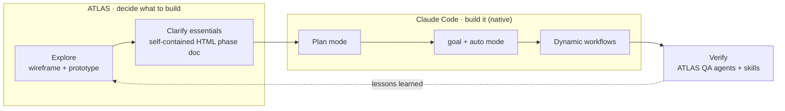

# SWE-ATLAS — a senior AI software engineer for Claude Code


> The senior-engineer layer for Claude Code. Explore before you build, clarify only what matters, capture it in living HTML — then hand it to Claude Code's native plan / goal / workflow loop. Fewer tokens, less ceremony, faster to the thing people actually pictured.

```bash
npx swe-atlas@latest new-project
```

One command. Full setup. No copy-pasting prompts every session.

ATLAS is an open-source **Claude Code template** — a curated set of skills, subagents, slash commands, and engineering conventions that turn Claude Code into a production-grade AI software engineer, with a wireframe-and-prototype workflow in place of heavyweight spec-driven development.

---

## Claude Code already builds. ATLAS decides what to build.

Claude Code now plans before it edits, works toward a goal across turns, runs autonomously with safety checks, and orchestrates fleets of subagents — natively, in the box:

| Native capability | What it does |
|---|---|
| **Plan mode** | Reads the codebase and proposes a plan; touches no files until you approve |
| **`/goal`** | Keeps working across turns until a checked completion condition holds |
| **Auto mode** | Approves its own safe tool calls, blocks destructive ones |
| **Dynamic workflows** | Writes a script that fans out dozens of subagents and cross-checks their findings |

That is the execution loop, and it keeps getting better. So ATLAS doesn't try to rebuild it.

What Claude Code still won't do for you is decide *what's worth building*, prove the shape works before you spend tokens generating it, and leave behind a document you can actually trust. That part is on you — and that part is ATLAS.

<sub>Auto mode and dynamic workflows are in research preview at the time of writing; plan mode and `/goal` are generally available.</sub>

---

## Why not another spec framework

The popular answer to "make the AI build the right thing" has been **Spec-Driven Development (SDD)**: write exhaustive specifications first, then generate the code from them. A constitution. A spec. A plan. A task breakdown. Five to seven Markdown files and a multi-phase pipeline — most of it produced *before a single screen has been seen*.

Four things go wrong:

- **You plan before you've learned.** The requirements, the task breakdown — most of it is a guess made before anyone has seen the thing work. You pay full freight to formalize guesses, build to them task by task, and find out at the end it isn't what anyone pictured. That's premature investment: detailed plans and guardrails poured around an idea nobody has validated yet.
- **Text leaves room to disagree.** A written spec is open to interpretation — you and the model can read the same paragraph and picture two different screens, and the gap only surfaces once the code exists. Prose is the wrong medium for *"do we mean the same thing?"*
- **Markdown drifts.** Keeping `spec.md`, `plan.md`, and `tasks.md` consistent with each other and with the code is its own tax — and plain `.md` can't even render the wireframe, flow, or matrix it's straining to describe.
- **The loop is already native.** Spec → plan → tasks → implement is precisely what plan mode, `/goal`, and workflows now do on their own. Wrapping a framework around the model to make it loop reinvents what ships in the box — at a heavy token premium, and slower, because every step waits on ceremony.

ATLAS takes the opposite bet: do the *minimum* upfront thinking that actually de-risks the build, make it cheap, fast, and visual — so a human and the model can look at the same thing and agree before a line is written — then hand a clean artifact to the native loop.

---

## What ATLAS does instead

### 1. Explore before you commit

Cheap, throwaway-friendly artifacts that let you *see* the thing before generating code for it:

- **`/brainstorm:wireframe`** — a low-fi wireframe as one self-contained HTML file
- **`/brainstorm:prototype`** — a clickable, multi-screen React prototype
- **`/design:create-design-md`** — three real design variants you compare in a browser, then lock as `DESIGN.md`

You validate the shape for the price of a sketch, not the price of a spec — in minutes, not phases. And a picture is the fastest way for a human and a model to agree on what to build: text invites interpretation, a wireframe pins it down.

### 2. Clarify only the essentials

**`/plan:create-phase`** resolves the *load-bearing* unknowns through targeted Q&A — and stops there. No constitution, no task ledger. The ambiguity that would actually derail the build gets surfaced and answered; the rest stays out of your way.

### 3. Document in HTML, not Markdown sprawl

A phase is captured as **one self-contained HTML document** — wireframe, data flow, clarifications, and decision matrices in a single file that opens in any browser. HTML is a far richer canvas than Markdown: real tables, SVG diagrams, annotated code, even sliders you tweak and copy back into a prompt. And people *actually read it* — a 100-line Markdown plan goes unopened; a shareable HTML link gets clicked. One robust artifact instead of a drift-prone pile of `.md`, and plan mode builds straight from it.

The Claude Code team makes this exact case in [*The Unreasonable Effectiveness of HTML*](https://claude.com/blog/using-claude-code-the-unreasonable-effectiveness-of-html). The honest tradeoff — HTML costs more tokens and time to generate than `.md` — is one ATLAS takes gladly: spend it on the *one* document that matters, not on seven that drift.

### 4. Bring senior judgment to every turn

A persistent engineering identity — principles, roles, and conventions — plus a library of skills and agents that load automatically. The model stops reaching for generic defaults and starts behaving like someone who has shipped before.

---

## Where ATLAS fits


```mermaid
flowchart LR
    subgraph ATL["ATLAS · decide what to build"]
        direction TB
        a1["Explore<br/>wireframe + prototype"]
        a2["Clarify essentials<br/>self-contained HTML phase doc"]
        a1 --> a2
    end
    subgraph CC["Claude Code · build it (native)"]
        direction TB
        b1["Plan mode"]
        b2["goal + auto mode"]
        b3["Dynamic workflows"]
        b1 --> b2 --> b3
    end
    a2 --> b1
    b3 --> v["Verify<br/>ATLAS QA agents + skills"]
    v -.lessons learned.-> a1
```

ATLAS owns the front of the loop (explore, clarify) and the judgment that runs through all of it; Claude Code owns execution. No overlap, no reinvention.

---

## Getting Started

### Quick start

```bash
# Scaffold into an existing project
cd your-project
npx swe-atlas@latest new-project

# Or scaffold into a new folder
npx swe-atlas@latest new-project my-workspace
```

The CLI walks you through: **CLAUDE.md flavor**, your name, project type, context templates, **which skills to install** (checkbox list — none preselected, `*` installs all), **browser automation** (Playwright MCP or Playwright CLI, isolated or persistent profile), and PostgreSQL — then scaffolds everything, copying each file from this repo as the single source of truth.

### Pick your CLAUDE.md flavor

| Flavor | What you get |
|---|---|
| **Vanilla** | Minimal CLAUDE.md — just NOTES.md and `docs/decision_logs/`, no ATLAS identity |
| **ATLAS — autonomous** | Full identity, no approval loop — built for unattended runs and one-shotting apps. The `free-will` skill is auto-installed and fires on medium-to-high-stakes forks: hold real alternatives open, ground them in evidence, refute the winner, log the decision |
| **ATLAS — collaborative** *(default)* | Full identity with the partner review/commit loop — you stay in the driver's seat |

Every flavor records important decisions (architecture, library choices, tradeoff calls) in `docs/decision_logs/` — ADR-style, with the rejected alternatives and the rationale — so future sessions know *why*, not just *what*.

### Manual setup

```bash
git clone --recurse-submodules https://github.com/syahiidkamil/Software-Engineer-AI-Agent-Atlas
cd Software-Engineer-AI-Agent-Atlas
```

Then run `/atlas:get-to-know` inside Claude Code.

### A typical first loop

```
/atlas:get-to-know                  # Configure ATLAS for your project
/design:create-design-md            # Lock visual identity via HTML variant prototyping
/brainstorm:prototype               # Validate the idea as a clickable prototype
/plan:create-phase "phase-01-mvp"   # Capture the essentials as a self-contained phase.html
# → switch to plan mode and let Claude Code build from it
```

---

## What's in the Box

**ATLAS** (Adaptive Technical Learning and Architecture System) operates as seven roles: Software Engineer, Solution Architect, Software Architect, Tech Lead, Business Analyst, Product Owner, and UI/UX Designer.

### 21 Skills

Installed à la carte — the scaffolder shows a checkbox list (none preselected; `*` installs all). Picking Playwright CLI as browser automation auto-adds `playwright-cli`; the autonomous flavor auto-adds `free-will`.

| Skill | Command | What it does |
|-------|---------|--------------|
| Free Will | `/free-will` | Deliberate choice on medium-to-high-stakes engineering forks — branch (urge · contrarian · synthesis · secret · dots · precedent · first-principles), ground in evidence, simulate consequences, refute the winner, log the decision. Fires autonomously on mechanical triggers |
| Abstraction Power | `/abstraction-power` | Pattern recognition — spot repetition, extract reusable abstractions |
| Learning From Mistakes | `/learning-from-mistakes` | Record a hard-won lesson after a bug is cracked, so it's never relearned |
| Playwright CLI | `/playwright-cli` | Token-efficient browser automation — drives the Playwright CLI through Bash instead of loading MCP tool schemas |
| Frontend Design | `/frontend-design` | Production-grade web UI with anti-AI-slop methodology |
| shadcn | `/shadcn` | shadcn/ui components, presets, registries, and project init |
| Theme Factory | `/theme-factory` | 10 professional themes for any artifact |
| Canvas Design | `/canvas-design` | Visual art and posters as PNG/PDF |
| Algorithmic Art | `/algorithmic-art` | Generative art using p5.js |
| Human Writing | `/human-writing` | Prose indistinguishable from a skilled human in any language (English + Bahasa Indonesia built in; add via `languages/{iso}.md`) |
| PDF | `/pdf` | Read, merge, split, watermark, OCR, fill forms |
| PPTX | `/pptx` | Create and edit slide decks |
| DOCX | `/docx` | Create and edit Word documents |
| XLSX | `/xlsx` | Spreadsheets with formulas, charts, data cleaning |
| PostgreSQL Code Review | `/postgresql-code-review` | Review SQL/migrations for correctness and safety |
| PostgreSQL Optimization | `/postgresql-optimization` | Diagnose slow queries, suggest indexes and rewrites |
| Supabase Postgres Best Practices | `/supabase-postgres-best-practices` | Idiomatic Supabase + Postgres patterns (RLS, auth, storage) |
| MCP Builder | `/mcp-builder` | Guide for creating MCP servers |
| Find Skills | `/find-skills` | Discover and install skills from the Anthropic library |
| Skill Creator | `/skill-creator` | Scaffold a new skill following the canonical format |
| Docs Anthropic | `/docs-anthropic` | On-demand index of official Claude Code / Anthropic docs — fetches the right page when you need it |

### 6 Agents

| Agent | Model | What it does |
|-------|-------|--------------|
| code-architect | Opus | Feature architecture with implementation blueprints |
| code-explorer | Opus | Trace execution paths, map architecture layers |
| code-review | Sonnet (×5) | Multi-agent PR review with confidence scoring |
| code-simplifier | Opus | Refine code for clarity while preserving functionality |
| qa-manual-tester | Inherit | Browser-based QA testing via Playwright |
| commit | Sonnet | Git commits following ATLAS convention |

### Commands

Commands are namespaced by **domain folder** under `.claude/commands/` — a file at `brainstorm/prototype.md` becomes `/brainstorm:prototype`. The domains: `atlas:` (onboarding), `plan:` / `plandev:` (planning & building), `design:` / `brainstorm:` (UX & visuals), `qa:` (testing), `start:` (run), `git:` (version control).

| Command | What it does |
|---------|--------------|
| `/atlas:get-to-know` | Initialize project context — understand the project, configure conventions, set up project rules |
| `/plan:create-phase "phase-01-mvp"` | Ambiguity-driven, wireframe-first phase — resolve unknowns via Q&A, then produce a self-contained `phase.html` (low-fi wireframe + clarifications + matrices) to build from in plan mode |
| `/plandev:feature` | Guided feature development with codebase exploration |
| `/design:create-design-md` | Lock visual identity — prototype 3 distinct HTML variants for browser comparison, then write `.claude/rules/DESIGN.md` in [Stitch format](https://github.com/google-labs-code/design.md) |
| `/brainstorm:wireframe` | Quick standalone low-fi wireframe as self-contained HTML (gray boxes, no framework) |
| `/brainstorm:prototype` | Clickable multi-screen React prototype for idea validation (`misc/prototypes/`) |
| `/qa:create-test-cases` | Author human-readable manual test cases (markdown) into `docs/living-test-cases/` |
| `/qa:manual-test-run` | Execute living test cases via the qa-manual-tester agent + Playwright MCP; results land in `misc/test-runs/` |
| `/start:be-fe` | Run backend and frontend in the background |
| `/git:commit` | Commit what's already staged (commit subagent, runs in background) |
| `/git:stage-commit` | Stage and commit all working-directory changes (commit subagent) |
| `/git:log` | Recent commits with a brief summary + continual context |

### Integrations

Browser automation is a scaffold-time choice — and either way you also choose the profile mode: **isolated** (fresh in-memory profile per session — the default, safe for concurrent/parallel testing) or **persistent** (profile saved to disk so logins survive restarts).

- **[Playwright MCP](https://github.com/microsoft/playwright-mcp)** — rich page snapshots via MCP tools; best when an agent reasons over page structure across a session. Configured in `.mcp.json`; persistent mode stores the profile in `misc/browser-storage/` (gitignored)
- **[Playwright CLI](https://github.com/microsoft/playwright-cli)** — token-efficient alternative: ~50 purpose-built commands the agent calls directly via Bash (`playwright-cli click "#submit"`) instead of loading large tool schemas into context. The scaffolder writes a project-scoped `.playwright/cli.config.json` and installs the `playwright-cli` skill; just add the binary: `npm install -g @playwright/cli@latest`
- **PostgreSQL MCP** — database access for queries and schema inspection (opt-in at scaffold time)

---

## How It Works

### Neuron activation through structure


AI coding assistants keep deep engineering capability locked behind generic defaults. Ask "write a function" and you get code. Give the same model structured context, engineering principles, and a persistent identity, and you get architected solutions — proper abstractions, error handling, scalability considered. The difference is **neuron activation**: the right instructions firing the right capabilities. ATLAS supplies those patterns by default, every session.

### Ground truth over guesswork

ATLAS treats its own output as something to verify, not assert. It reads the file before describing the code, runs the thing before calling it done, and looks at the screen before reporting the UI. A confidence hierarchy puts direct observation and your confirmation above inferred behavior and untested assumptions — so "it works" means it was checked, not hoped. It's the discipline a spec can't give you: you can't specify your way out of a wrong assumption, you can only test it.

### Vibecoding with guardrails

Roughly a quarter of recent YC startups report 95%-AI-generated codebases. Without engineering discipline, that code turns unmaintainable fast. ATLAS keeps the conversational speed but anchors it to production-grade, industry-appropriate defaults — KISS, YAGNI, and DRY applied in balance, not as an excuse to under-build.

---

## Repository Structure

```
├── CLAUDE.md                        # ATLAS identity & entry point
├── NOTES.md                         # Regular notes and must-follow rules
├── claude_md_variants/              # CLAUDE.md flavors the CLI scaffolds from (vanilla / autonomous / collaborative)
├── repos/                           # Your projects (multi-repo mode)
├── .claude/
│   ├── skills/                      # 21 specialized skills (installed à la carte)
│   ├── agents/                      # 6 task-specific agents
│   ├── commands/                    # Slash commands, namespaced by domain folder
│   │   ├── atlas/  brainstorm/  design/
│   │   ├── plan/   plandev/     qa/
│   │   └── git/    start/
│   ├── hooks/                       # Task completion & input hooks
│   └── rules/                       # Project rules — conventions + DESIGN.md (auto-loaded)
├── docs/
│   ├── decision_logs/               # ADR-style decisions — choice, rejected branches, rationale
│   ├── external-information/        # Git submodules (Anthropic plugins & skills)
│   ├── phases/                      # Phase docs (self-contained HTML)
│   ├── living-spec-docs/            # Living specs, maintained as the product evolves
│   ├── living-test-cases/           # Manual test cases (markdown)
│   └── learning-from-mistakes/      # Captured engineering lessons
├── misc/
│   ├── self/                        # ATLAS identity & principles (atlas.md, engineering.md)
│   ├── prototypes/                  # Clickable React prototypes
│   ├── test-runs/                   # QA test-run results
│   └── context-templates/           # Convention templates
├── .playwright/cli.config.json     # Project-scoped Playwright CLI profile config
└── .mcp.json                        # MCP server configuration
```

---

**`npx swe-atlas@latest new-project` and start building.**

*ATLAS — FAANG experience for scale. Startup experience for pragmatism.*
