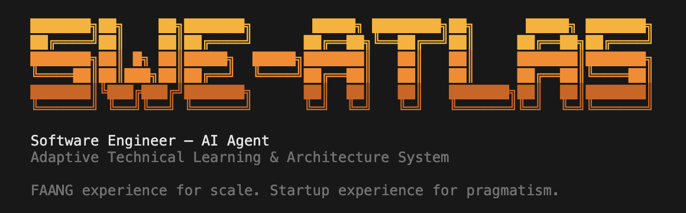
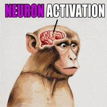

# swe-atlas



> Turn Claude Code into a senior software engineer with persistent identity, real engineering principles, and production-grade tooling.

## Quick Start

```bash
npx swe-atlas@latest new-project "project-folder-name"
```

If no folder name is provided, the current directory is used.

## Installation

```bash
# Or install globally
npm install -g swe-atlas
swe-atlas new-project
```

## Update

```bash
# Always use the latest version
npx swe-atlas@latest new-project

# Or update global install
npm update -g swe-atlas
```

## What It Does

The CLI interactively asks:

1. **Your name** — ATLAS refers to you as "Boss"
2. **Project type** — Single repo or Multi repo (workspace with `repos/` folder)
3. **Context templates** — Which conventions to activate (all are copied, you pick what's active)
4. **MCP servers** — Playwright (browser automation), PostgreSQL (database access)

Then scaffolds the full ATLAS setup:

```
your-project/
├── CLAUDE.md                # ATLAS identity & entry point
├── IMPORTANT_NOTES.md        # Critical lessons & warnings
├── .claude/
│   ├── skills/              # 11 specialized skills
│   ├── agents/              # 6 task-specific agents
│   ├── commands/            # 5 slash commands
│   ├── hooks/               # Task completion hooks
│   ├── settings.json        # Permissions config
│   └── settings.local.json  # Local overrides
├── self/ (or atlas/self/)    # Identity & engineering principles
├── context-templates/        # All convention templates
├── development-context/      # Active conventions for this project
├── external_information/     # Git submodules (plugins, skills)
├── automation_tests/         # QA test cases and results
├── docs/                     # Project documentation
├── misc/prompts/             # Prompt templates
└── .mcp.json                 # MCP server configuration
```

## Single vs Multi Repo

| | Single Repo | Multi Repo |
|---|---|---|
| Use case | One project | Workspace with multiple projects |
| Identity files | `atlas/self/` | `self/` |
| Projects | Your existing code stays as-is | `repos/backend/`, `repos/frontend/` |
| Command | `npx swe-atlas new-project` | `npx swe-atlas new-project my-workspace` |

## What You Get

### 11 Skills

| Skill | What It Does |
|-------|--------------|
| `/abstraction-power` | Pattern recognition — identify and extract reusable abstractions |
| `/frontend-design` | Production-grade web UI with anti-AI-slop methodology |
| `/human-writing` | Content indistinguishable from skilled human writers |
| `/pdf` | Read, merge, split, watermark, OCR, fill forms |
| `/pptx` | Create and edit slide decks |
| `/docx` | Create and edit Word documents |
| `/xlsx` | Spreadsheets with formulas, charts, data cleaning |
| `/canvas-design` | Visual art and posters as PNG/PDF |
| `/algorithmic-art` | Generative art using p5.js |
| `/theme-factory` | 10 professional themes for any artifact |
| `/mcp-builder` | Guide for creating MCP servers |

### 6 Agents

| Agent | What It Does |
|-------|--------------|
| code-architect | Feature architecture with implementation blueprints |
| code-explorer | Trace execution paths, map architecture layers |
| code-review | Multi-agent PR review with confidence scoring |
| code-simplifier | Refine code for clarity and maintainability |
| qa-manual-tester | Browser-based QA testing via Playwright |
| commit | Git commits following ATLAS convention |

### 5 Commands

| Command | What It Does |
|---------|--------------|
| `/atlas-setup` | Configure ATLAS for your project |
| `/feature-dev` | Guided feature development with codebase exploration |
| `/run-be-fe` | Run backend and frontend in background |
| `/qa-manual-test-run` | Execute QA test cases |
| `/commit` | Commit using sub-agent |

## After Setup

Open your project in Claude Code and:

```
/atlas-setup              # Configure ATLAS for your project
/feature-dev              # Guided feature development
"Add user authentication" # Or just describe what you need
```

---

## The Neuron Activation Problem



AI coding assistants have deep engineering capabilities locked behind generic defaults. The difference between "write a function" and a properly activated AI Software Engineer is like night and day.

**Context rot** — models advertise 200k-1M token windows, but performance degrades long before the limit. The 10,000th token is not as trustworthy as the 10th.

**Vibecoding hangovers** — without engineering principles, AI-generated code becomes unmaintainable fast.

**Repetitive setup** — every session means re-explaining project structure, conventions, and decisions from scratch.

ATLAS solves all three. Persistent identity. Structured context. Engineering principles that load automatically. Just open the project and build.

---

## Links

- [GitHub Repository](https://github.com/syahiidkamil/Software-Engineer-AI-Agent-Atlas)
- [Claude Code](https://claude.ai/claude-code)

## License

MIT
